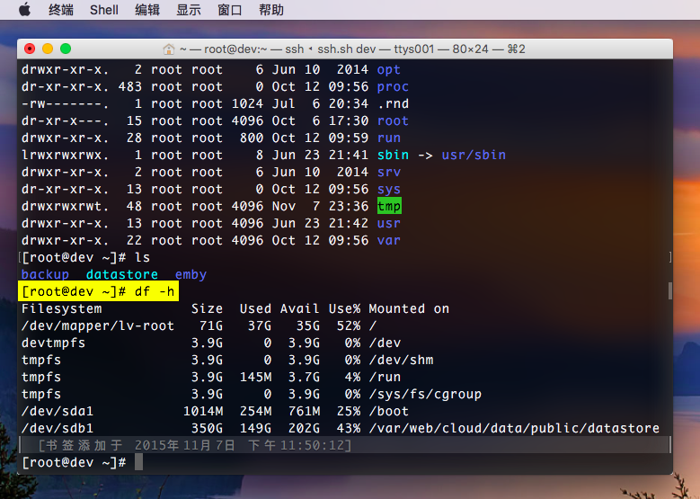
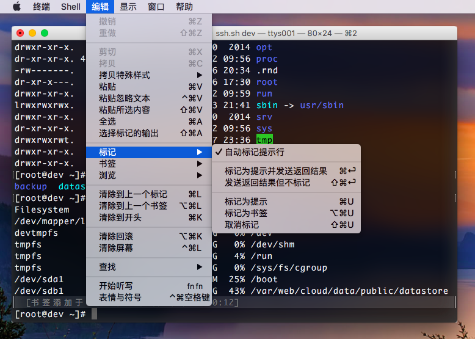

# 标记书签 - Mark Bookmark

> 作者：[Aspire](http://prettyxw.com)

在 OS X El Captain 中，新增加了 “标记（Marks）” 和 “书签（Bookmarks）” 功能，作用是可以快速跳到命令行历史的标记处和书签处。

默认情况下，每当执行命令时会自动标记提示行，并不需要手动标记。在命令行历史的最左边出现的小中括号就代表的是历史标记，使用 `⌘ + ↑` 和 `⌘ + ↓` 可以快速在历史标记中跳跃。这个功能在使用一些输出很长的命令行操作时就显得非常有用，比如在检查 GitLab 运行状态时执行 `bundle exec rake gitlab:check RAILS_ENV=production`，想要查看该操作的输出时不再需要向上滚动去找输出的开头，只需要按下 `⌘ + ↑` 就能跳到上一个命令执行的地方。除了添加标记，还可以添加书签，功能是类似的。

在 “编辑（Edit）” 菜单中的 “标记（Marks）”、“书签（Bookmarks）” 和 “浏览（Navigate）” 子菜单中可以查看有关标记和书签的功能和快捷键，除此之外还有其他比如 “清除到上一个标记（Clear to Previous Mark）”、“清除到上一个书签（Clear to Previous Bookmark）” 等与之相关的其它快捷功能。