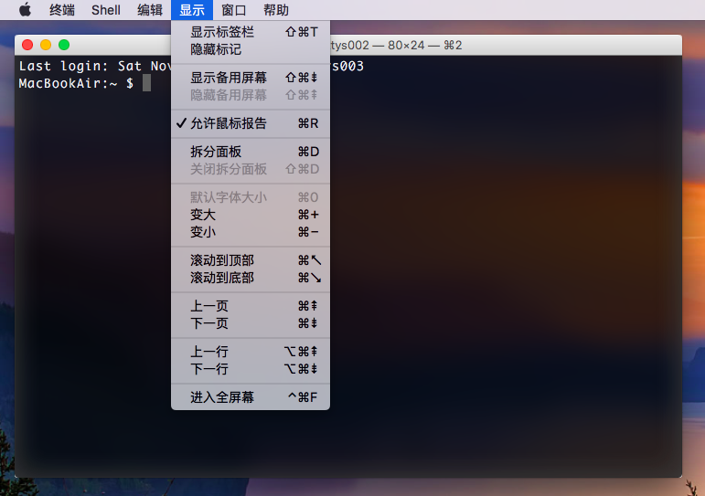
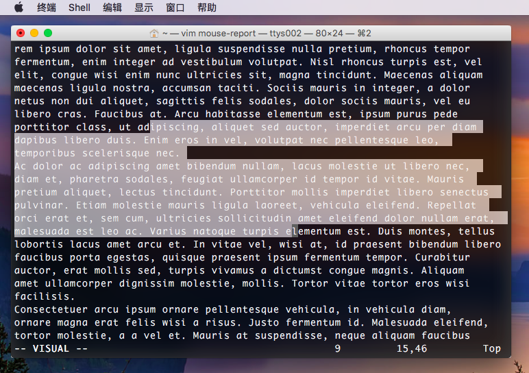

# 鼠标报告 - Mouse Report

> 作者：[Aspire](http://prettyxw.com)

## 简介

在 OS X El Captain 中，新增加了鼠标支持，该功能被称作 “鼠标报告（Mouse Report）”。这是一项在 Linux 终端中非常常见的功能，就是可以在一些支持鼠标操作的编辑器中使用鼠标进行辅助操作，一般可以进行上下滚动和选择文本等，比较常见的例子就是在 VIM 编辑器中使用鼠标。

## 启用和禁用

在 “菜单 -> 显示 -> 允许鼠标报告” 选项可以选择开启或关闭鼠标报告功能，快捷键是 `⌘ + R`。

## 使用实例

可以在 VIM 编辑状态下使用鼠标拖动选中文本，可以通过滚轮来上下滚动屏幕。