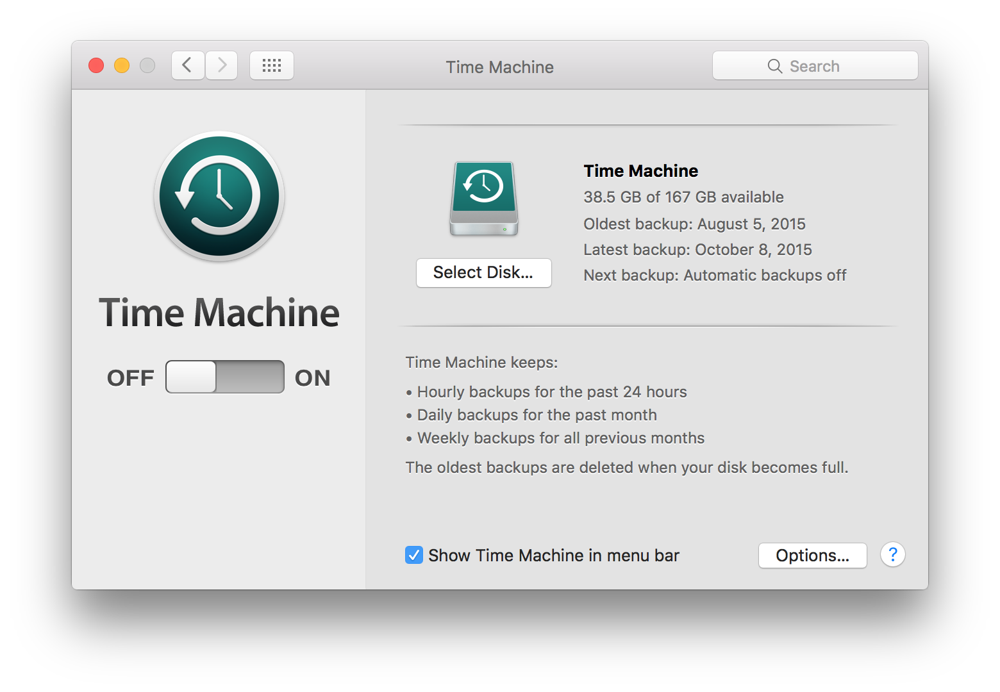
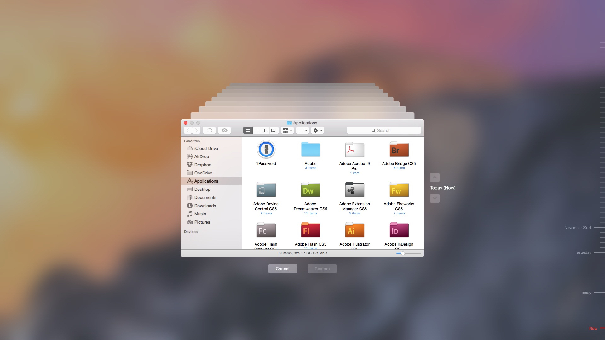
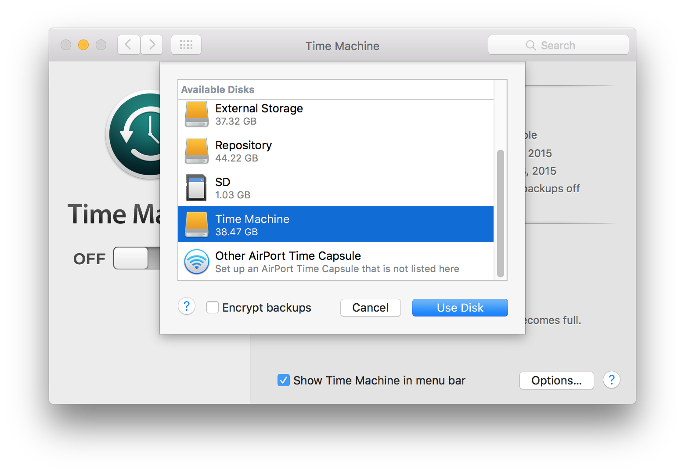
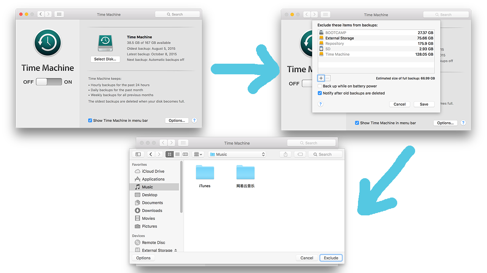
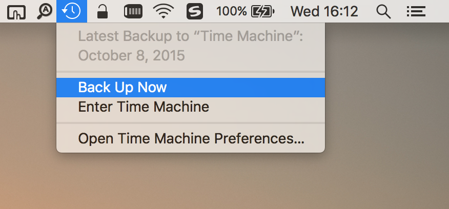

#如何设置 Time Machine 并备份  
> 作者：[AaronVon](https://github.com/AaronVon)    
  
  

在便携式电脑上使用 Time Machine 时，Time Machine 不仅会在备份磁盘上保留所有内容的一份副本，还会将已更改文件的“本地快照”存储在内置磁盘上，因此您可以恢复之前的版本。除非关闭 Time Machine，否则这些本地快照将每小时进行一次，而且它们将储存在您便携式电脑的内置磁盘上。如果意外删除或更改文件，可以使用 Time Machine 恢复。 

即使 Time Machine 在便携式电脑上创建本地快照，您也应该将文件备份到内置磁盘之外的位置，如外置硬盘、网络磁盘或 Time Capsule。这样，如果您的内置磁盘或 Mac 出现问题，您可以将整个系统恢复到另一台 Mac，并立即在所属位置取回所有信息。

1. 将外置硬盘连接到 Mac 并将其打开。  
系统将询问您是否要使用磁盘备份 Mac。然后选择你希望备份至的磁盘介质。同时也可以勾选左下角的“加密备份”，以提高数据安全性。  

2. 点按“用作备份磁盘”，然后遵循“Time Machine”偏好设置中的说明执行操作。  
若要打开“Time Machine”偏好设置，请选取苹果菜单 >“系统偏好设置”，然后点按“Time Machine”。  
3. 排除某些特定文件及文件夹的备份    
选择 `Options` > `+` > `你想排除的文件（夹）` > `Exclude`

4. Time Machine 会每隔一段时间自动备份一次（如果开启了自动备份）。当然如果你也可以选择手动**立即备份**。  
