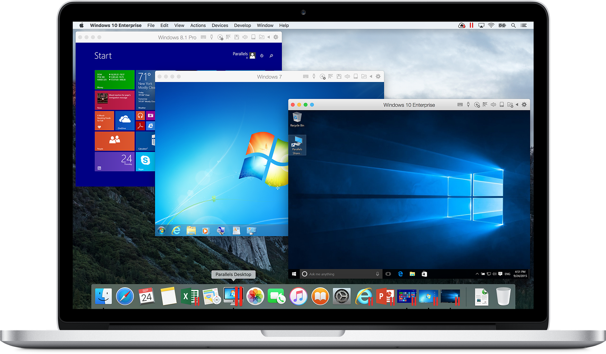
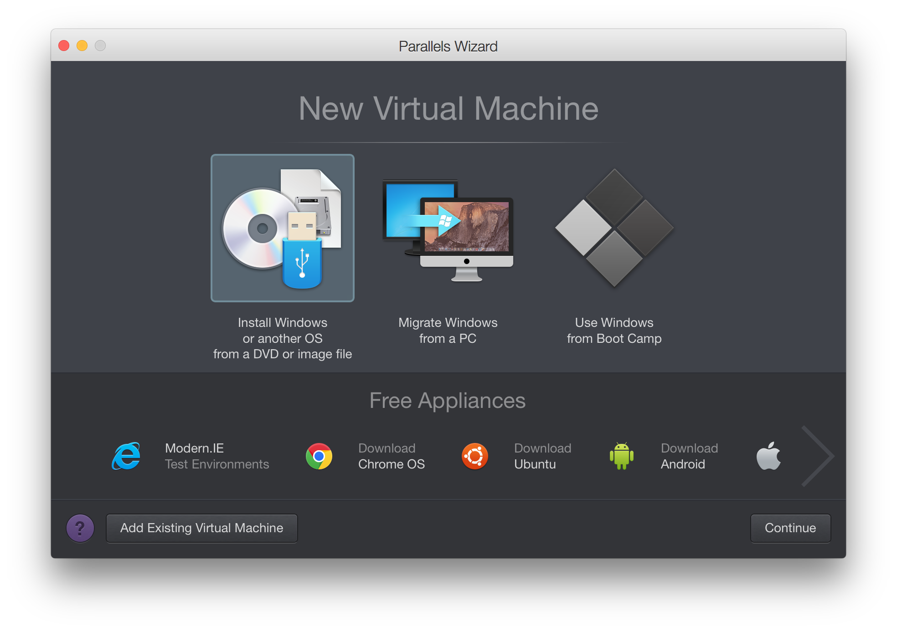
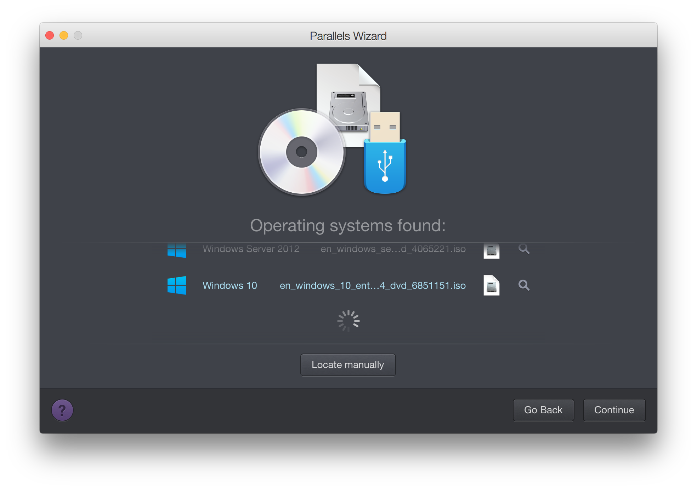
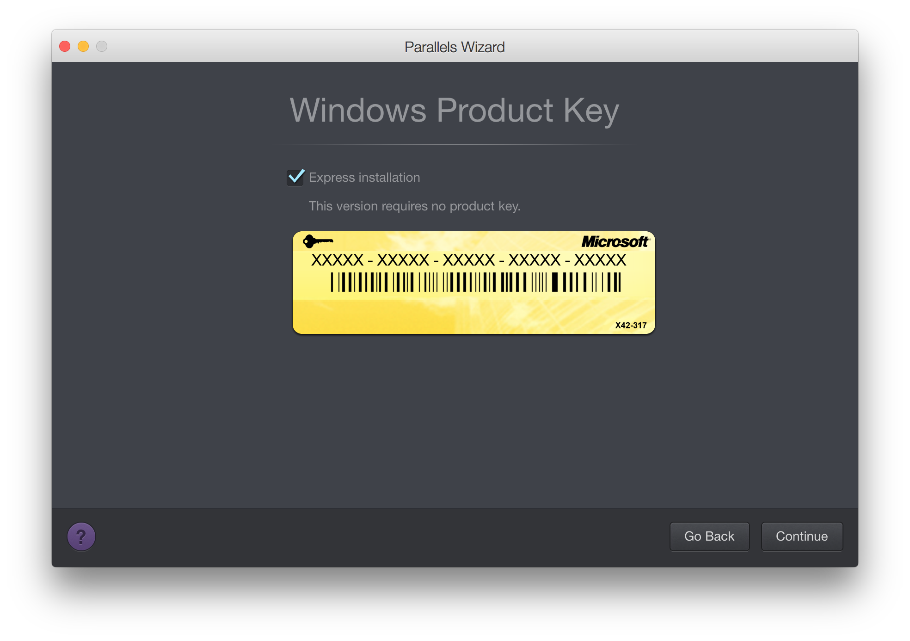
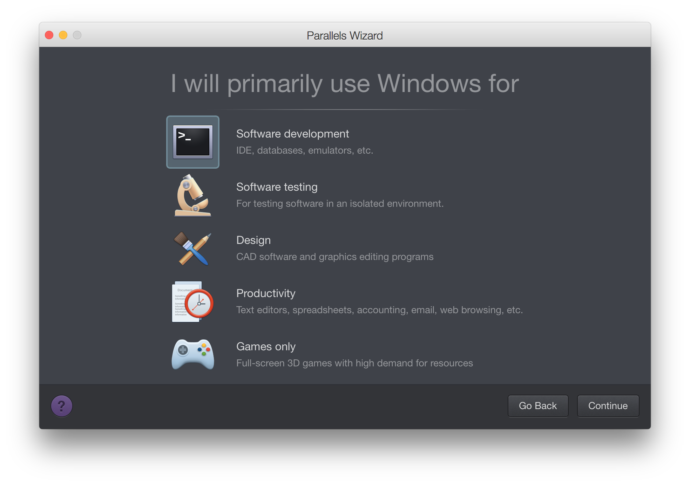
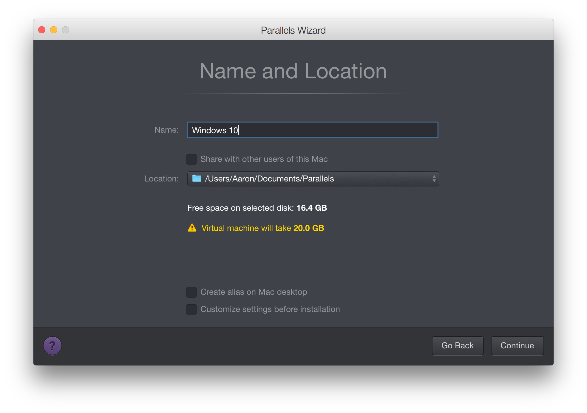

#Parallels Desktop 虚拟机
在 Mac 上以最便捷、快速、高效的方式运行 Windows ！

>Parallels Desktop 11 以更加无缝的方式将 Windows 和 OS X 体验结合在了一起。-- John Martellaro，the Mac Observer

##下载安装 Parallels Desktop
---
Parallels Desktop 是一个收费的软件，可以从[这里获得](http://www.parallels.com/cn/products/desktop/)它的完整版以及试用版。

##安装 Windows
----

- 打开 Parallels Desktop，选择从 ISO 镜像安装 Windows，并点击继续  

- 选择 你希望安装的 Windows ISO 镜像文件，并继续  

- 勾选快速安装（可以跳过安装时输入产品激活码的步骤）

- 选择你所希望使用 Parallels Desktop 的用途

- 确定虚拟机的名字以及存放位置

- 之后剩余的安装步骤就和正常安装 Windows 的方法一样了